# Отчет
## IO-bound. Проверяем ссылки на страницах Википедии
### 1 worker
#### Во время работы:

#### Результаты выполнения:
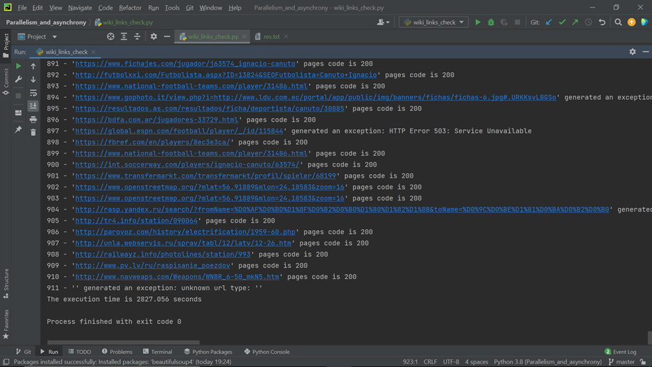

### 5 workers
#### Во время работы:

#### Результаты выполнения:
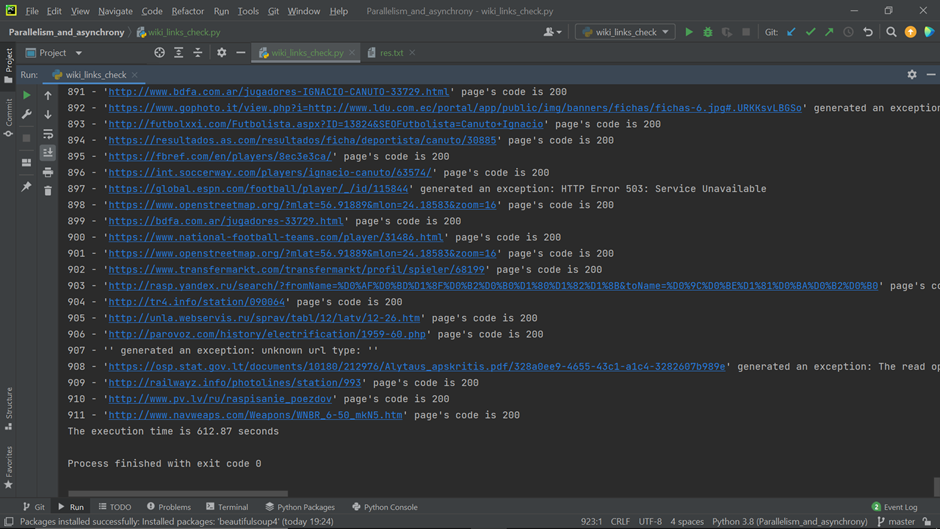

### 10 workers
#### Во время работы:
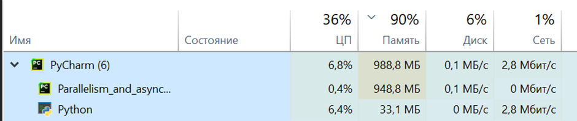
#### Результаты выполнения:
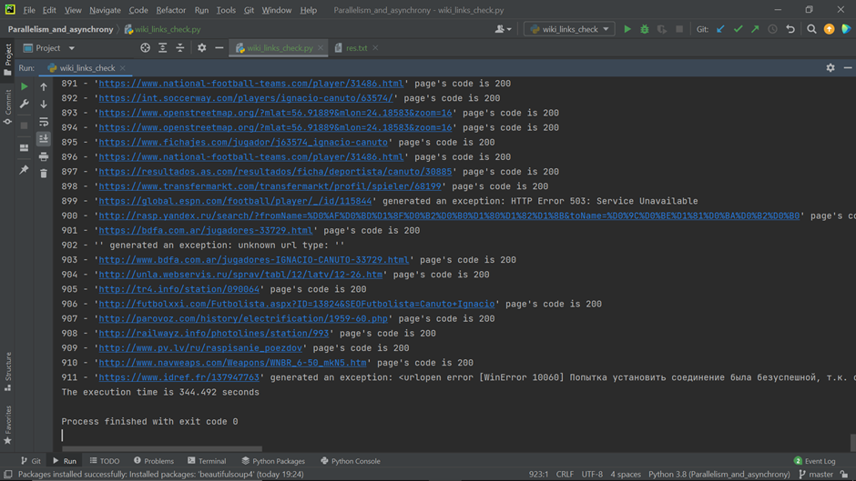

### 100 workers
#### Во время работы:
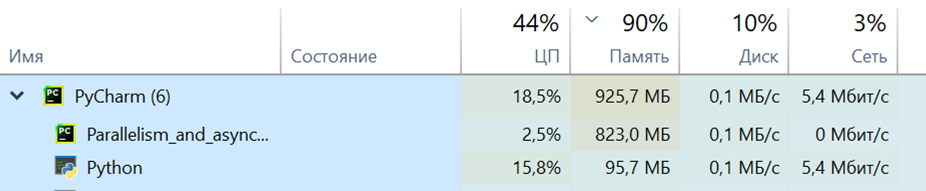
#### Результаты выполнения:
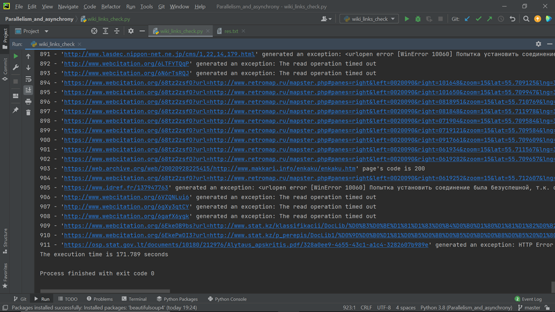

### Вывод: 
При увеличении количества воркеров время выполнения заметно уменьшается, загрузка ЦП и сети увеличиваются. Объем рабочей памяти, используемой процессом, по сравнению с 1 воркером увеличился, но для 5, 10 и 100 воркеров различается не сильно.

## CPU-bound. Генерируем монетки

### 1 worker 
#### Во время работы:

#### Результаты выполнения:

### 2 workers
#### Во время работы:
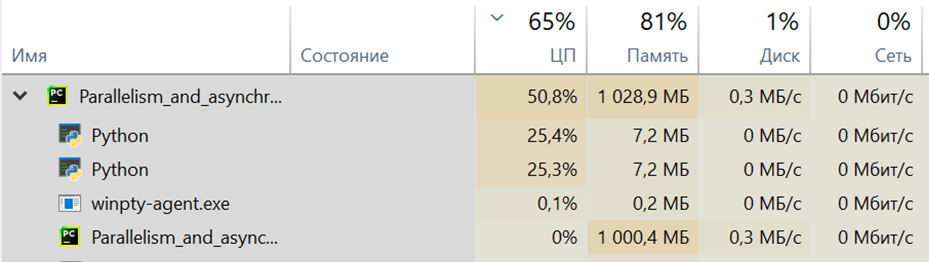
#### Результаты выполнения:
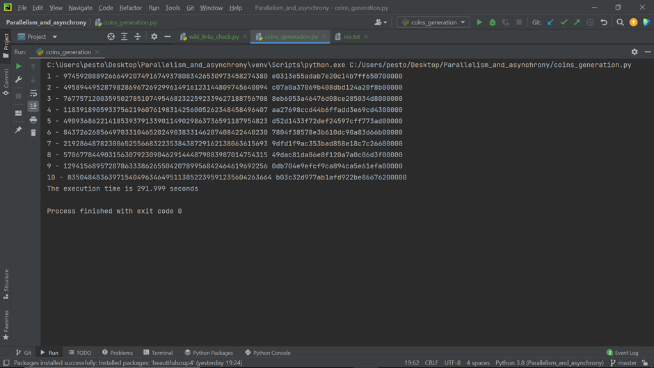

### 4 workers
#### Во время работы:
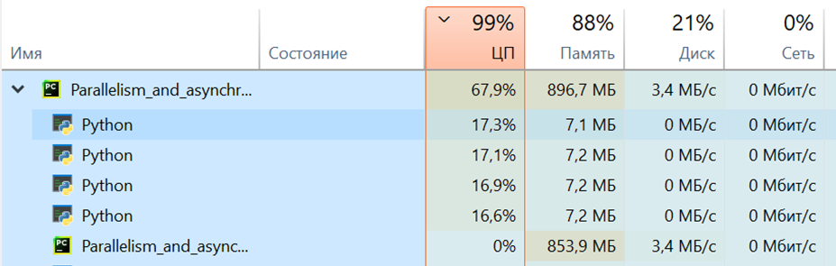
#### Результаты выполнения:

### 5 workers
#### Во время работы:
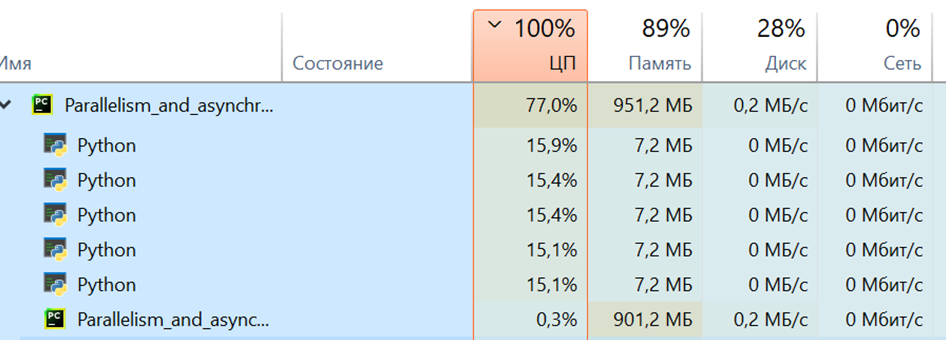
#### Результаты выполнения:
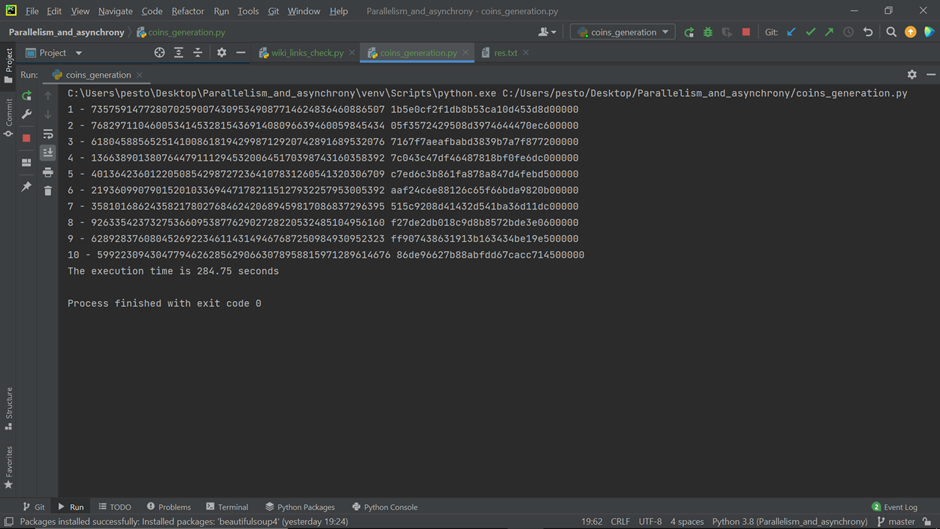

### 10 workers
#### Во время работы:
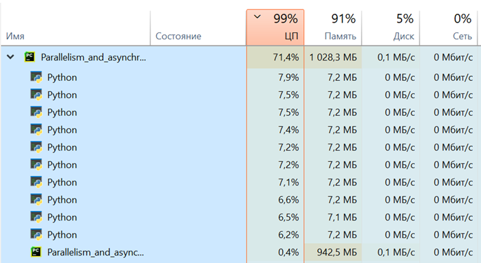
#### Результаты выполнения:
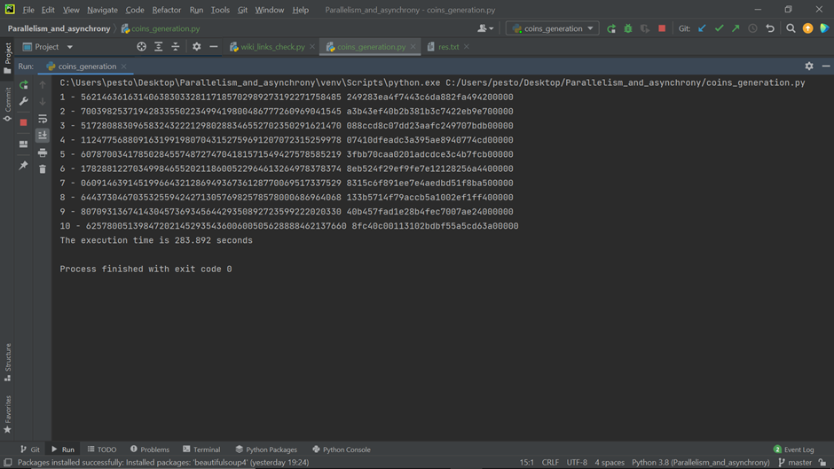
### 100 workers (61 workers)
При 100 воркерах произошла ошибка, поэтому пришлось изменить на 61.
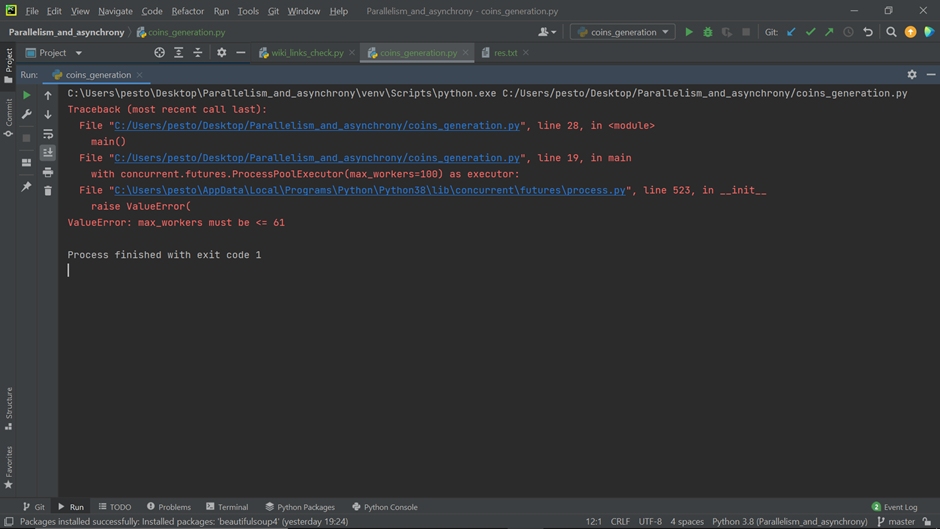
При 61 тоже произошла ошибка - изменила на 60.
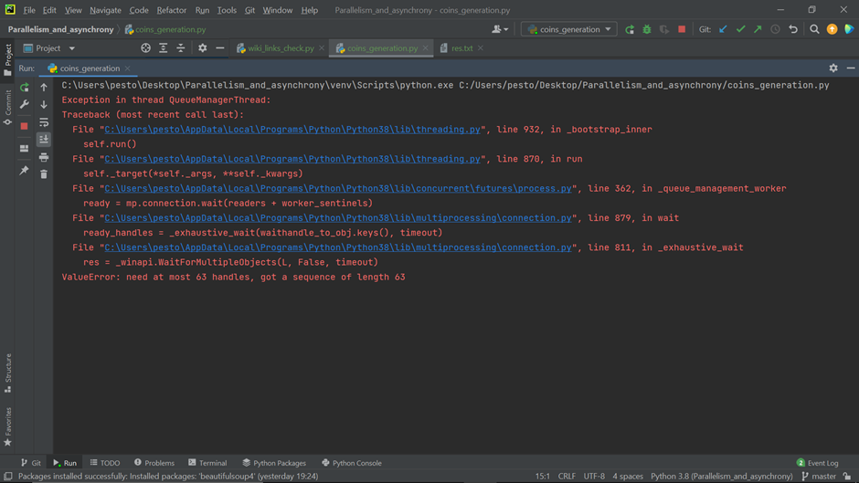
#### Во время работы:
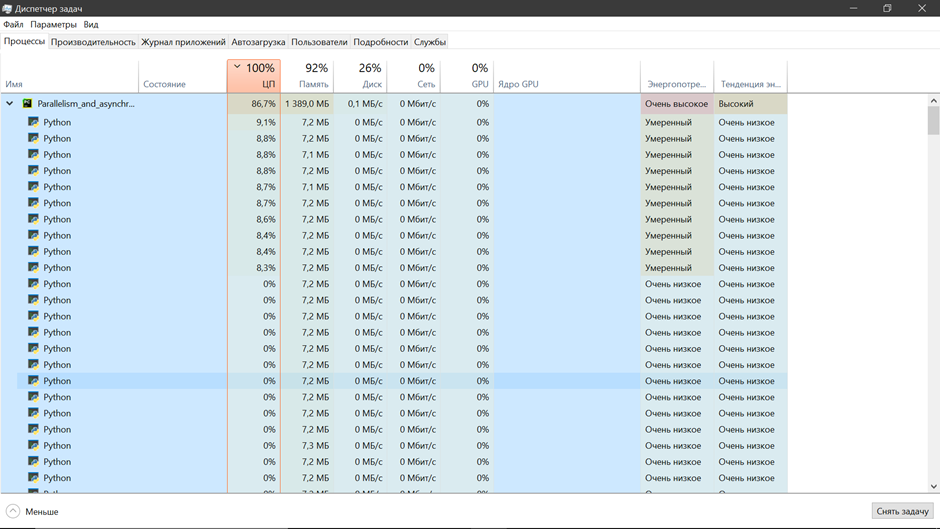
#### Результаты выполнения:
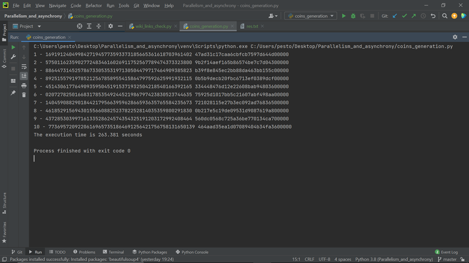

### Вывод: 
Наименьшее время выполнения было при 4 воркерах. Наибольшее - при 1 воркере. При 2, 5, 10 и 60 время выполнения было примерно одинаковым. 
